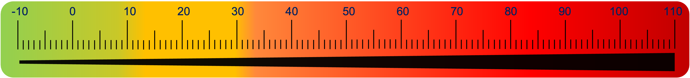

## Why Standardize Amyloid PET Quantification?

Amyloid PET imaging has revolutionized our ability to detect and quantify amyloid-beta plaques *in vivo* — a defining pathological characterisic of Alzheimer's disease. But different tracers (e.g., PiB, Florbetapir, Florbetaben, Flutemetamol, [F-18]NAV4694) and processing pipelines produce different scales. A value of 1.4 SUVr in one study might mean something very different in another.

  

This variability makes it difficult to:
- Compare results across studies or centres
- Pool data from different cohorts
- Define universally accepted cut-offs for amyloid positivity

To address this, the **Centiloid scale (CL)** was proposed by Klunk et al. (2015), with the idea to define a **standardized metric** across tracers and pipeline. The scale has two *anchor* points:

- **0 CL**: Mean amyloid burden in young healthy controls  
- **100 CL**: Mean amyloid burden in mild-to-moderate Alzheimer's disease patients

  

Once mapped to this scale, SUVr values from *any* validated tracer and pipeline can be **converted to Centiloids**, enabling consistent interpretation and comparison in various contexts (see Interpretation tab).

## Key Features of the Centiloid Scale

- 📈 Linear transformation of SUVr  
- 📊 Validated across multiple tracers and processing methods  
- 🔧 Requires pipeline validation if using custom methods  
- 🔗 Supported by an open-access reference implementation via [GAAIN](https://www.gaain.org/centiloid-project)

## Workshop overview:

This app was designed to provide an overview of the Centiloid scale with interactive examples.
The following topics are covered:
- How the Centiloid is defined and calculated  
- How to interpret it
- How to validate your own processing pipeline  
- Provide a database of software with Centiloid

Let’s get started :)

